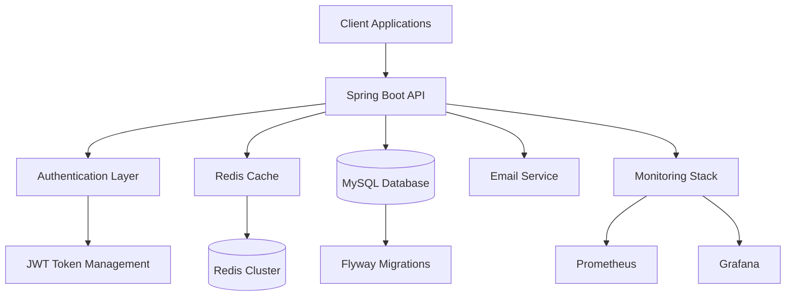
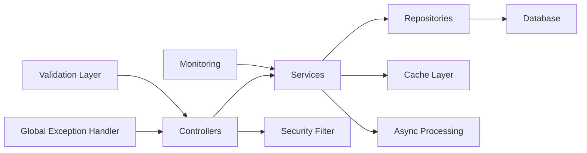

# 🚀 SpringApp - Enterprise-Grade Spring Boot Boilerplate

> 🌟 **A production-ready, secure, and scalable Spring Boot 3.5.0 application with Java 21, featuring advanced authentication, caching, monitoring, and microservices-ready architecture.**

[](https://spring.io/projects/spring-boot)
[](https://openjdk.org/)
[](https://redis.io/)
[](https://www.mysql.com/)
[](https://spring.io/projects/spring-security)

---

## 📋 **Table of Contents**

- [✨ Key Features](#-key-features)
- [🏗️ Architecture Overview](#️-architecture-overview)
- [🔧 Technology Stack](#-technology-stack)
- [🚀 Quick Start](#-quick-start)
- [📚 API Documentation](#-api-documentation)
- [🛡️ Security Features](#️-security-features)
- [⚡ Performance Features](#-performance-features)
- [📊 Monitoring & Observability](#-monitoring--observability)
- [📁 Project Structure](#-project-structure)
- [🔍 Configuration Details](#-configuration-details)

---

## ✨ **Key Features**

### 🔐 **Advanced Security**

- **JWT-based Authentication** with configurable expiration times
- **Role-Based Access Control (RBAC)** with granular permissions
- **Email Verification** with OTP system
- **Password Strength Validation** with custom validators
- **Session Management** with stateless design
- **CSRF Protection** and security headers

### 🏗️ **Modern Architecture**

- **Layered Architecture** (Controller → Service → Repository)
- **Modular Design** with clear separation of concerns
- **Dependency Injection** with Spring IoC container
- **Aspect-Oriented Programming** for cross-cutting concerns
- **Event-Driven Architecture** with async processing

### ⚡ **Performance & Scalability**

- **Redis Caching** with configurable TTL
- **Async Processing** with dedicated thread pools
- **Connection Pooling** with HikariCP
- **Database Optimization** with JPA/Hibernate
- **Circuit Breaker** pattern with Resilience4j

### 📊 **Monitoring & Observability**

- **Micrometer Metrics** with Prometheus integration
- **Custom Metrics** for business operations
- **Health Checks** with Spring Boot Actuator
- **Structured Logging** with SLF4J
- **Performance Monitoring** with custom timers

### ️ **Data Management**

- **MySQL Database** with optimized schema
- **Flyway Migration** for version control
- **JPA/Hibernate** with advanced features
- **MapStruct** for efficient object mapping
- **Audit Trail** with automatic tracking

---

## 🏗️ **Architecture Overview**

### **High-Level Architecture**



### **Application Layers**



---

## **Technology Stack**

### **Core Framework**

| Technology      | Version | Purpose                         |
| --------------- | ------- | ------------------------------- |
| **Spring Boot** | 3.5.0   | Core application framework      |
| **Java**        | 21      | Programming language            |
| **Maven**       | Latest  | Build and dependency management |

### **Database & Persistence**

| Technology          | Purpose            | Features                          |
| ------------------- | ------------------ | --------------------------------- |
| **MySQL**           | Primary database   | ACID compliance, transactions     |
| **Spring Data JPA** | ORM framework      | Repository pattern, query methods |
| **Hibernate**       | JPA implementation | Advanced mapping, caching         |
| **Flyway**          | Database migration | Version control, rollback support |

### **Security & Authentication**

| Technology            | Purpose            | Features                      |
| --------------------- | ------------------ | ----------------------------- |
| **Spring Security**   | Security framework | Authentication, authorization |
| **JWT (jjwt)**        | Token management   | Stateless authentication      |
| **BCrypt**            | Password hashing   | Secure password storage       |
| **Custom Validators** | Input validation   | Strong password requirements  |

### **Caching & Performance**

| Technology           | Purpose             | Features                        |
| -------------------- | ------------------- | ------------------------------- |
| **Redis**            | Distributed caching | Session storage, data caching   |
| **Spring Cache**     | Cache abstraction   | Method-level caching            |
| **HikariCP**         | Connection pooling  | Database connection management  |
| **Async Processing** | Background tasks    | Email sending, heavy operations |

### **Monitoring & Observability**

| Technology               | Purpose                | Features                |
| ------------------------ | ---------------------- | ----------------------- |
| **Spring Boot Actuator** | Application monitoring | Health checks, metrics  |
| **Micrometer**           | Metrics collection     | Custom business metrics |
| **Prometheus**           | Metrics storage        | Time-series data        |
| **Resilience4j**         | Circuit breaker        | Fault tolerance         |

### **Development Tools**

| Technology          | Purpose             | Features                 |
| ------------------- | ------------------- | ------------------------ |
| **Lombok**          | Code generation     | Reduces boilerplate      |
| **MapStruct**       | Object mapping      | Type-safe mapping        |
| **Swagger/OpenAPI** | API documentation   | Auto-generated docs      |
| **DevTools**        | Development support | Hot reload, auto-restart |

---

## 🚀 **Quick Start**

### **Prerequisites**

- **Java 21** or higher
- **Maven 3.6+**
- **MySQL 8.0+**
- **Redis 6.0+**

### **1. Clone Repository**

```bash
git clone https://github.com/Nhatnguyen150100/spring-boot-boilerplate.git
cd spring-boot-boilerplate
```

### **2. Database Setup**

```sql
CREATE DATABASE springapp_db CHARACTER SET utf8mb4 COLLATE utf8mb4_unicode_ci;
```

### **3. Configuration**

```bash
cp src/main/resources/application.example.properties src/main/resources/application.properties
```

**Required Configuration:**

```properties
# Database
spring.datasource.url=jdbc:mysql://localhost:3306/springapp_db
spring.datasource.username=your_username
spring.datasource.password=your_password

# JWT
application.security.jwt.secret-key=your-super-secret-key-here
application.security.jwt.expiration=86400000
application.security.jwt.refresh-token.expiration=604800000

# Redis
spring.data.redis.host=localhost
spring.data.redis.port=6379

# Email (for OTP)
spring.mail.host=smtp.gmail.com
spring.mail.username=your-email@gmail.com
spring.mail.password=your-app-password
```

### **4. Build & Run**

```bash
mvn clean install
mvn spring-boot:run
```

### **5. Verify Installation**

```bash
curl http://localhost:8080/actuator/health
open http://localhost:8080/swagger-ui/index.html
```

---

## 📚 **API Documentation**

### **Authentication Endpoints**

| Method   | Endpoint              | Description               | Auth Required |
| -------- | --------------------- | ------------------------- | ------------- |
| `POST`   | `/auth/register`      | Register new user         | ❌            |
| `POST`   | `/auth/login`         | User login                | ❌            |
| `POST`   | `/auth/refresh-token` | Refresh JWT token         | ❌            |
| `DELETE` | `/auth/logout`        | User logout               | ✅            |
| `POST`   | `/auth/activate`      | Activate account with OTP | ❌            |
| `POST`   | `/auth/resend-otp`    | Resend OTP email          | ❌            |

### **User Management**

| Method | Endpoint                | Description         | Auth Required |
| ------ | ----------------------- | ------------------- | ------------- |
| `GET`  | `/api/v1/users/profile` | Get user profile    | ✅            |
| `PUT`  | `/api/v1/users/profile` | Update user profile | ✅            |
| `GET`  | `/api/v1/users/{id}`    | Get user by ID      | ✅ (Admin)    |

### **File Upload**

| Method | Endpoint         | Description | Auth Required |
| ------ | ---------------- | ----------- | ------------- |
| `POST` | `/api/v1/upload` | Upload file | ✅            |

### **Response Format**

```json
{
  "statusCode": 200,
  "message": "Success",
  "data": {
    // Response data
  },
  "timestamp": "2024-01-01T12:00:00Z"
}
```

---

## 🛡️ **Security Features**

### **Authentication Flow**

1. **Registration**: User registers with email/password
2. **Email Verification**: OTP sent to email for verification
3. **Login**: JWT token issued upon successful authentication
4. **Token Refresh**: Automatic token refresh mechanism
5. **Logout**: Token invalidation and cleanup

### **Authorization Levels**

```java
public enum ERole {
    USER,    // Basic user permissions
    ADMIN    // Administrative permissions
}
```

### **Security Headers**

- **CORS** configuration for cross-origin requests
- **CSRF** protection (disabled for API)
- **Content Security Policy** headers
- **X-Frame-Options** protection
- **HSTS** headers for HTTPS

### **Password Security**

- **BCrypt** hashing with salt
- **Custom validation** for strong passwords
- **Minimum requirements**: 8 chars, uppercase, lowercase, number, special char

### **JWT Configuration**

```properties
# Token expiration (24 hours)
application.security.jwt.expiration=86400000

# Refresh token expiration (7 days)
application.security.jwt.refresh-token.expiration=604800000

# Secret key (change in production)
application.security.jwt.secret-key=your-secret-key
```

---

## ⚡ **Performance Features**

### **Caching Strategy**

- **User caching** with 10-minute TTL
- **Token caching** with 5-minute TTL
- **Method-level caching** with Redis
- **Session storage** in Redis

### **Async Processing**

- **Email sending** with dedicated thread pool
- **Task processing** with configurable thread pool
- **Background operations** for heavy tasks

### **Database Optimization**

- **Connection pooling** with HikariCP
- **Query optimization** with JPA/Hibernate
- **Indexed queries** for performance
- **Batch operations** for bulk processing

### **Monitoring Metrics**

- **Login attempts** counter
- **Registration attempts** counter
- **Login duration** timer
- **Cache hit/miss** ratios
- **Database connection** metrics

---

## 📊 **Monitoring & Observability**

### **Health Checks**

```bash
# Application health
GET /actuator/health

# Database health
GET /actuator/health/db

# Redis health
GET /actuator/health/redis
```

### **Metrics Endpoints**

```bash
# All metrics
GET /actuator/metrics

# Custom metrics
GET /actuator/metrics/auth.login.attempts
GET /actuator/metrics/auth.login.duration
```

### **Custom Metrics**

- **Login attempts** counter
- **Registration attempts** counter
- **Login duration** timer
- **Registration duration** timer
- **Cache hit/miss** ratios
- **Database connection** metrics

---

## 📁 **Project Structure**

```
src/main/java/com/spring/app/
├── BaseSpringApplication.java          # Main application class
├── common/                            # Shared components
│   ├── entities/                      # Base entities
│   ├── pagination/                   # Pagination DTOs
│   ├── response/                     # Response wrappers
│   └── validation/                   # Custom validators
├── configs/                          # Configuration classes
│   ├── SecurityConfig.java           # Security configuration
│   ├── CacheConfig.java              # Redis cache config
│   ├── AsyncConfig.java              # Async processing
│   ├── MetricsConfig.java            # Monitoring config
│   └── properties/                   # Configuration properties
├── constants/                        # Application constants
├── enums/                           # Enumerations
├── exceptions/                       # Custom exceptions
├── filter/                          # Security filters
├── modules/                         # Business modules
│   ├── auth/                        # Authentication module
│   │   ├── controller/              # REST controllers
│   │   ├── dto/                     # Data transfer objects
│   │   ├── entities/                # Domain entities
│   │   ├── mapper/                  # Object mappers
│   │   ├── repositories/            # Data access layer
│   │   └── services/                # Business logic
│   ├── user/                        # User management
│   └── upload/                      # File upload
├── shared/                          # Shared services
│   ├── interfaces/                  # Service interfaces
│   └── services/                    # Shared implementations
├── templates/                       # Email templates
└── utils/                          # Utility classes
```

---

## 🔍 **Configuration Details**

### **Database Configuration**

```properties
# MySQL Configuration
spring.datasource.url=jdbc:mysql://localhost:3306/springapp_db
spring.datasource.username=root
spring.datasource.password=
spring.datasource.driver-class-name=com.mysql.cj.jdbc.Driver

# JPA/Hibernate Configuration
spring.jpa.hibernate.ddl-auto=update
spring.jpa.show-sql=true
spring.jpa.properties.hibernate.format_sql=true
spring.jpa.open-in-view=false
```

### **Redis Configuration**

```properties
# Redis Configuration
spring.data.redis.host=localhost
spring.data.redis.port=6379
spring.data.redis.password=
spring.data.redis.timeout=60000

# Cache Configuration
spring.cache.type=redis
spring.cache.redis.time-to-live=600000
```

### **Email Configuration**

```properties
# SMTP Configuration
spring.mail.host=smtp.gmail.com
spring.mail.port=587
spring.mail.username=your-email@gmail.com
spring.mail.password=your-app-password
spring.mail.properties.mail.smtp.auth=true
spring.mail.properties.mail.smtp.starttls.enable=true
```

### **Async Configuration**

```properties
# Async Processing
async.core-size=2
async.max-size=10
async.queue-capacity=100
```

---

## 📞 **Support**

- **Email**: nhatnguyen150100@gmail.com
- **Documentation**: [Wiki](https://github.com/Nhatnguyen150100/spring-boot-boilerplate/wiki)
- **Issues**: [GitHub Issues](https://github.com/Nhatnguyen150100/spring-boot-boilerplate/issues)
- **Discussions**: [GitHub Discussions](https://github.com/Nhatnguyen150100/spring-boot-boilerplate/discussions)

---

> **Made with ❤️ by nhatnguyen150100@gmail.com**
>
> **Built for modern, scalable, and secure applications**
