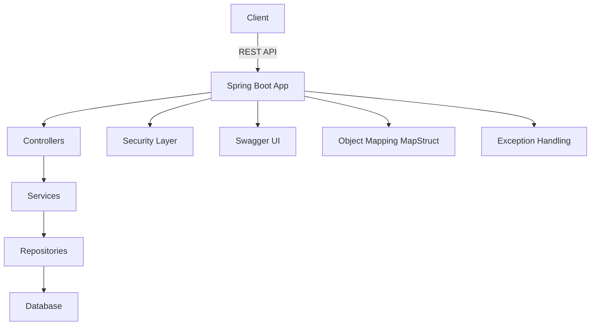

# 🚀 SpringApp &nbsp;   

> 🌱 **A modern, secure, and well-structured Spring Boot 3.5.0 project with Java 21 and production-ready features.**

---

## ✨ **Key Features**

- 🔐 **Advanced Security**: Spring Security with JWT & role-based access control.
- 🧩 **Modular Design**: Clear separation of concerns with layered architecture.
- 🗃️ **Robust Data Layer**: Spring Data JPA + MySQL + MapStruct mapping.
- 📘 **API Documentation**: Auto-generated Swagger/OpenAPI UI.
- 🧪 **Ready for Testing**: Integrated validation and test-ready setup.
- 🐳 **Docker-Ready**: Includes Docker & Docker Compose support.
- ⚙️ **Dev Efficiency**: DevTools, Lombok, and Maven-based build system.
- 📏 **Code Quality**: Built-in validation framework and best practices.

---

## 🏛️ **Project Architecture Overview**



- **src/**
  - `controller/` – API endpoints
  - `service/` – Business logic
  - `repository/` – Data access layer
  - `model/` – Entity and DTO definitions
  - `config/` – Security and app configurations
  - `mapper/` – MapStruct mappers
  - `exception/` – Global exception handlers

---

## 🚀 **Quick Start**

### 1️⃣ Clone & Build

```bash
git clone https://github.com/your-org/springapp.git
cd springapp
```

Configure database in `src/main/resources/application.properties`.

```bash
mvn clean install
```

### 2️⃣ Run Locally

```bash
mvn spring-boot:run
```

### 3️⃣ Docker Deployment

```bash
docker-compose up --build
```

---

## 🛡️ **Security Highlights**

- **JWT Authentication**: Stateless token-based auth.
- **Role-based Authorization**: Access control at endpoint level.
- **Spring Security**: Custom filters and config.

---

## 📚 **API Documentation**

Swagger UI will be available at:

```
http://localhost:8080/swagger-ui.html
```

---

## 🧪 **Testing & Validation**

> Includes Spring Boot validation and test-friendly structure.

```bash
mvn test
```

---

## 🛠️ **Tech Stack**

| Tool/Library         | Purpose                          |
|----------------------|----------------------------------|
| **Spring Boot 3.5.0**| Core framework                   |
| **Java 21**          | Programming language             |
| **MySQL**            | Relational database              |
| **MapStruct**        | DTO mapping                      |
| **Spring Security**  | Authentication & authorization   |
| **Swagger/OpenAPI**  | API documentation                |
| **Docker**           | Containerization                 |
| **Maven**            | Build and dependency management  |

---

## 📏 **Code Quality & Workflow**

- **Lombok**: Reduces boilerplate code.
- **Validation**: Hibernate Validator support.
- **DevTools**: Fast refresh during dev.

---

## ❤️ **Contributing**

1. Fork this repo and create your branch
2. Follow Java/Spring best practices
3. Create a PR and describe your changes

---

## 📣 **Resources & References**

- [Spring Boot Docs](https://docs.spring.io/spring-boot/)
- [Spring Security](https://spring.io/projects/spring-security)
- [MapStruct](https://mapstruct.org/)
- [Swagger/OpenAPI](https://swagger.io/)
- [Docker](https://www.docker.com/)

---

> Made with ❤️ by nhatnguyen150100@gmail.com